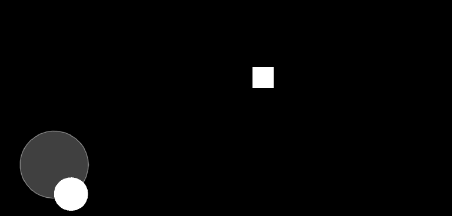

# lovejoy
 Lovejoy is a virtual joystick libary to help with mobile devlopment
on love2d framework engine.

## Exemple

```lua
local lovejoy = require("lovejoy")

function love.load()
    joystick = lovejoy(160, love.graphics.getHeight() - 160)
    joystick:setOnlyNormalize(true)
    joystick:setFallowFinger(false)

    player = {x = 16, y = 16, w = 32, h = 32}
    player.velocity = {x = 0, y = 0}
end

function love.draw()
    joystick:draw()
    love.graphics.rectangle("fill", player.x, player.y, player.w, player.h)
end

function love.update(deltaTime)
    local normX, normY = joystick:update(deltaTime)
    player.velocity.x, player.velocity.y = normX*speed, normY*speed
    player.x = player.x + player.velocity.x*deltaTime
    player.y = player.y + player.velocity.y*deltaTime
end
```

## Functions
### External api
- lovejoy(x, y, r, fallowClicķ, fallowFinger, onlyNormal)  
 It create a new joystick object to be handled, the parameters 
`r, fallowClicķ, fallowFinger, onlyNormal` are by default
`64, true, true, false`, x and y is the joystuck possition, r is the 
joystick radius, fallowClick is when you click then the joystick teleports
to your touch, the fallowFinger make it fallow your touch if its out of
the joystick and onlynormal make the paddler and joystick distance irrelevany
and only with base in the direction.  
**return** joystick object

- joystick:draw()  
 It's used to draw the joystick without textures and nothing special  
**return** nothing

- joystick:update(deltaTime)  
 It's the joystick update, here it update your touches, joystick and paddler position, if 
its pressed and hovered, if you touched in joystick area and etc. the main it that it's
return the normalized directions.
 **return** normalX, normalY

### advanced api
- joystick:getNormalized()  
 it get the normX and normY without update the joystick.  
**return** normX, normY

- joystick:isPressed()  
 it get if thw joystick is pressed.  
**return** isPressed

- joystick:isHover()  
 it get if thw joystick is hovered.  
**return** isHover

- joystick:setPosition(_x, _y)  
 set the joystick position (where it will be return when released not when it go 
when pressed).  
**return** nothing

- joystick:setRadius(_r)  
 set joystick radius.    
**return** nothing

- joystick:setOnlyNormal(_onlyNormal)  
 make the paddler and joystick distance irrelevany
and only with base in the direction.  
**return** nothing

- joystick:setFallowFinger(_fallowFinger)  
 set if the joystuck will fallow the touch. 
**return** nothing

- joystick:setFallowClick(_fallowClick)  
 set if the joystick will teleport when clicked.  
**return** nothing

## installation
1. Download the raw file
2. Require it in your game  
`lovejoy = require("lovejoy")`
3. Insert all external api necessary
```lua
function love.load()
    joystick = lovejoy(160, love.graphics.getHeight() - 160)
end

function love.draw()
    joystick:draw()--its not really necessary but if you don't use this
--or any texture you don't will see nothing.
end

function love.update(deltaTime)
    joystick:update(deltaTime)
end
```

## Credits
 Blood wolf (me :3)